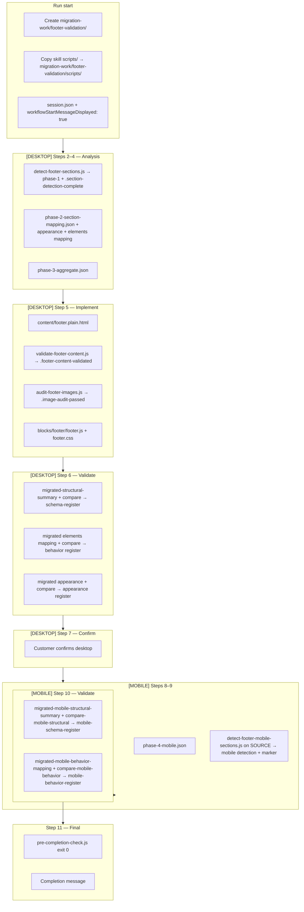

# Footer Orchestrator — Implementation Flowchart

End-to-end flow from **session init** through **desktop + mobile validation complete**. Nav orchestrator is the richer reference (megamenu, critique, style registers); this chart matches the **11-step footer** workflow.

## Optional sub-agent quality gate

After any phase JSON is written from a sub-agent, run:

`node migration-work/footer-validation/scripts/validate-output.js <file.json> <schema.json>`

Use schemas from `references/*-agent-schema.json` (see `reference-index.md`).

---

## Plan revalidation (narrative vs enforcement)

**Verdict:** The original plan — **11 steps**, **desktop-first**, **three desktop compares** (structural, elements behavior, appearance), **programmatic section detection** (desktop + mobile source), **hooks + scripts** as two layers, then **pre-completion** — is still the right shape. Repeated “gaps” in implementation were not from a bad sequence; they came from **(1)** keeping several documents and the hook code in sync when edge cases appeared, and **(2)** limits hooks cannot cover.

**What hooks cannot enforce (by design):**

| Planned item | Why it still “gaps” if ignored |
|--------------|--------------------------------|
| **Step 7 — customer confirmation before mobile** | No API for “user said yes”; only SKILL.md / prompts. Phase 4 is blocked on **technical** desktop completion, not on a human flag. |
| **Sub-agent honesty** | Hooks see files on disk, not whether Playwright was actually used. Mitigation: debug.log script markers + SKILL rules. |
| **Stale `migration-work/footer-validation/scripts/`** | Step 1 copies from the skill; the repo hook bundle under `.agents/hooks/` is canonical for gate logic. Old workspace copies diverge from `.agents/skills/excat-footer-orchestrator/scripts/`. |

**Single source of truth for gate logic:** `.agents/hooks/footer-validation-gates/checks.js`, `gate-table.js`, and `.agents/hooks/footer-validation-gate.js` (Stop). When behavior changes, update in code **and** `references/footer-validation-gates-summary.md` (and SKILL bullets if user-facing text is wrong).

**Appearance (must match `compare-footer-appearance.js`):** Phase 2 produces **source** `footer-appearance-mapping.json` with **required `layoutSpacing`** (px strings) plus optional `leadCaptureBand`, **`promoMediaBand`** (large image strips), **`primaryLinkBand`** (desktop link grid vs accordion), and `noticeStrip`. Desktop validation produces **migrated** mapping + run compare → `footer-appearance-register.json` (includes `layoutSpacingMatch`). `checkDesktopComplete` / Stop / `pre-completion-check.js` require: if source exists → migrated file + register with `allValidated` before Phase 4 / completion; migrated without source is invalid.

**Step → engine map (quick):**

| Steps | Planned outcome | Enforcement |
|-------|-----------------|-------------|
| 2 | Phase 1 + marker | `MANDATORY_SCRIPTS`, Stop |
| 3 | Phase 2 + source appearance + elements (`layoutSpacing` before CSS) | Phase 2 / CSS gates, `checkFooterAppearanceMappingBeforeImplementation` |
| 5 | Content + audit + `footer.js` / `footer.css` | `MANDATORY_SCRIPTS`, image / content gates |
| 6 | Migrated artifacts + 3 compares | `checkDesktopComplete`, Stop, compare nudges in `MANDATORY_SCRIPTS` |
| 8–10 | Phase 4 + mobile detection + compares | `DESKTOP_COMPLETE`, mobile markers + mobile compares in gates |
| 11 | Done | Stop + `pre-completion-check.js` |
