# Navigation Orchestrator — Full Implementation Flowchart

End-to-end flow from the **first file created** through **desktop + mobile validation complete**. Each node shows the file/artifact produced; scripts and gates are annotated.

---

## Master Flowchart (Step-by-Step)

```mermaid
flowchart TB
    subgraph START["🚀 RUN START"]
        A0["Create migration-work/navigation-validation/"]
        A0b["Copy skill scripts/ → migration-work/navigation-validation/scripts/ + npm install"]
        A1["session.json + workflowStartMessageDisplayed"]
    end

    subgraph P1["[DESKTOP] Step 1 — Header Row Detection"]
        B1["phase-1-row-detection.json<br/>rowCount, confidence, uncertainty, notes"]
    end

    subgraph P2["[DESKTOP] Step 2 — Row Element Mapping"]
        B2["phase-2-row-mapping.json<br/>rows, hasImages, hasHoverBehavior, hasClickBehavior<br/>hasHamburgerIcon, hasSearchForm, hasLocaleSelector"]
        B2b["header-appearance-mapping.json (source)<br/>headerBackgroundBehavior: defaultState, interactionState<br/>REQUIRED before header.css — gate blocks"]
    end

    subgraph P3["[DESKTOP] Step 3 — Megamenu Analysis"]
        B3["phase-3-megamenu.json<br/>triggerType, columnCount, hasImages, overlayBehavior"]
        B3b["megamenu-mapping.json<br/>navTriggers, panelItems, panelLayoutDetails<br/>measuredLeft/Right, viewportWidth"]
    end

    subgraph P3c["[DESKTOP] Step 4c — Header Appearance (all headers)"]
        B3c2["migrated-header-appearance-mapping.json<br/>migrated: after implementation (source from Phase 2)"]
        B3c3["compare-header-appearance.js → header-appearance-register.json<br/>includes headerBackgroundBehavior"]
    end

    subgraph AGG["[DESKTOP] Step 4 — Aggregate + Implementation"]
        C1["phase-5-aggregate.json<br/>headerStructure, desktopMapping, megamenuMapping<br/>mobileMapping: pending"]
        C2["content/nav.plain.html<br/>brand, sections, tools — HTML images"]
        C3["validate-nav-content.js<br/>→ .nav-content-validated marker"]
        C4["blocks/header/header.js"]
        C5["blocks/header/header.css"]
    end

    subgraph BEH5["[DESKTOP] Step 5 — Megamenu Behavior (FIRST)"]
        D1["migrated-megamenu-mapping.json<br/>panelLayoutDetails with measured values"]
        D2["compare-megamenu-behavior.js<br/>→ megamenu-behavior-register.json"]
    end

    subgraph BEH5a["[DESKTOP] Step 5a — Row Elements Behavior"]
        D3["row-elements-mapping.json<br/>source: hover+click every element"]
        D4["migrated-row-elements-mapping.json<br/>migrated: hover+click every element"]
        D5["compare-row-elements-behavior.js<br/>→ row-elements-behavior-register.json"]
    end

    subgraph STRUC["[DESKTOP] Step 6 — Structural Schema (SECOND)"]
        E1["migrated-structural-summary.json<br/>extracted from migrated page"]
        E2["compare-structural-schema.js --output-register<br/>→ schema-register.json<br/>threshold 95%"]
    end

    subgraph GATE7["[DESKTOP] Step 7 — Pre-Confirmation Gate"]
        F1["✅ validate-nav-content exit 0"]
        F2["✅ megamenu-behavior-register allValidated"]
        F3["✅ row-elements-behavior-register allValidated"]
        F4["✅ header-appearance-register allValidated"]
        F5["✅ schema-register allValidated"]
        F6["🛑 STOP — Request customer confirmation"]
    end

    subgraph P4["[MOBILE] Step 8 — Mobile Analysis"]
        G1["phase-4-mobile.json<br/>hamburgerAnimation, openBehavior, accordionBehavior<br/>slideInPanelBehavior, hasSearchForm, hasLocaleSelector"]
        G2["Update phase-5-aggregate.json<br/>mobileMapping: real data"]
    end

    subgraph IMPL_M["[MOBILE] Step 9 — Mobile Implementation"]
        H1["Update header.css — @media breakpoints"]
        H2["Update header.js — hamburger, accordion/slide-in<br/>viewport resize / matchMedia"]
    end

    subgraph VAL_M["[MOBILE] Steps 10–12 — Mobile Validation"]
        I1["mobile/migrated-mobile-structural-summary.json"]
        I2["mobile/mobile-schema-register.json"]
        I3["mobile/mobile-heading-coverage.json<br/>allCovered: true"]
        I4["mobile/mobile-behavior-register.json<br/>tapMatch, behaviorMatch, animationMatch"]
    end

    subgraph REG["[REGISTERS] Step 13 — Build Style Registers"]
        J1["style-register.json<br/>row-0-logo, megamenu-trigger-0, ..."]
        J2["mobile/mobile-style-register.json<br/>mobile-hamburger-icon, mobile-nav-heading-0, ..."]
    end

    subgraph CRIT["[CRITIQUE] Step 14 — Targeted Visual Critique (4 key components)"]
        K1["4 key-component subagents in parallel<br/>desktop 1440×900 + mobile 375×812"]
        K2["critique/{id}/source.png, migrated.png, critique-report.json"]
        K3["mobile/critique/{id}/..."]
        K4["≥95% each, critiqueIterations ≥ 1"]
    end

    subgraph FINAL["[CRITIQUE] Step 15 — Final Gate + Report"]
        L1["All registers validated"]
        L2["Report to customer"]
    end

    A0 --> A0b
    A0b --> A1
    A1 --> B1
    B1 --> B2
    B2 --> B3
    B3 --> B3b
    B3 --> B3c1
    B3b --> C1
    B3 --> C1
    C5 --> B3c2
    B3c1 --> B3c3
    B3c2 --> B3c3
    C1 --> C2
    C2 --> C3
    C3 --> C4
    C4 --> C5
    C5 --> D1
    D1 --> D2
    C5 --> D3
    D3 --> D4
    D4 --> D5
    D2 --> E1
    D5 --> E1
    B3c3 --> E1
    E1 --> E2
    E2 --> F1
    F1 --> F2
    F2 --> F3
    F3 --> F4
    F4 --> F5
    F5 --> F6
    F6 --> G1
    G1 --> G2
    G2 --> H1
    H1 --> H2
    H2 --> I1
    I1 --> I2
    I2 --> I3
    I3 --> I4
    I4 --> J1
    J1 --> J2
    J2 --> K1
    K1 --> K2
    K2 --> K3
    K3 --> K4
    K4 --> L1
    L1 --> L2
```



---

## File Creation Order (Chronological)

| # | File | Step | Script / Action |
|---|------|------|-----------------|
| 0 | `migration-work/navigation-validation/scripts/*` | Run start | Copy from skill `scripts/` + `npm install` in that folder |
| 1 | `session.json` | Run start | After workflow message + bootstrap |
| 2 | `phase-1-row-detection.json` | Step 1 | `detect-header-rows.js` |
| 3 | `phase-2-row-mapping.json` | Step 2 | Desktop nav agent |
| 4 | `phase-3-megamenu.json` | Step 3 | Megamenu agent |
| 5 | `megamenu-mapping.json` | Step 3 (deep) | Per-item analysis |
| 6 | `header-appearance-mapping.json` | **Step 2 (Phase 2)** | Source observation; REQUIRED before header.css; includes headerBackgroundBehavior |
| 7 | `phase-5-aggregate.json` | Step 4 | Aggregate phases 1–3 |
| 8 | `content/nav.plain.html` | Step 4 | Content-first |
| 9 | `.nav-content-validated` | Step 4 | `validate-nav-content.js` |
| 10 | `blocks/header/header.js` | Step 4 | Implementation |
| 11 | `blocks/header/header.css` | Step 4 | Implementation |
| 12 | `migrated-megamenu-mapping.json` | Step 5 | Migrated page testing |
| 13 | `megamenu-behavior-register.json` | Step 5 | `compare-megamenu-behavior.js` |
| 14 | `row-elements-mapping.json` | Step 5a | Source hover/click |
| 15 | `migrated-row-elements-mapping.json` | Step 5a | Migrated hover/click |
| 16 | `row-elements-behavior-register.json` | Step 5a | `compare-row-elements-behavior.js` |
| 17 | `migrated-header-appearance-mapping.json` | Step 4c | Migrated observation |
| 18 | `header-appearance-register.json` | Step 4c | `compare-header-appearance.js` |
| 19 | `migrated-structural-summary.json` | Step 6 | Extract from migrated |
| 20 | `schema-register.json` | Step 6 | `compare-structural-schema.js --output-register` |
| 21 | `phase-4-mobile.json` | Step 8 | Mobile nav agent |
| 21b | `mobile/mobile-structure-detection.json` + `.mobile-structure-detection-complete` | Step 5b | `detect-mobile-structure.js --url=<source>` (375×812). Programmatic row/item count; hook blocks until run. |
| 22 | `mobile/migrated-mobile-structural-summary.json` | Step 10 | Mobile extract (same shape as mobile-structure-detection) |
| 23 | `mobile/mobile-schema-register.json` | Step 10 | `compare-mobile-structural-schema.js` (source + migrated mobile structure) |
| 24 | `mobile/mobile-heading-coverage.json` | Step 11 | Click every heading |
| 25 | `mobile/mobile-behavior-register.json` | Step 12 | Tap/click/animation |
| 26 | `style-register.json` | Step 13 | Build component list |
| 27 | `mobile/mobile-style-register.json` | Step 13 | Build mobile list |
| 28 | `critique/{id}/*` | Step 14 | nav-component-critique |
| 29 | `mobile/critique/{id}/*` | Step 14 | nav-component-critique |

---

## Hook Enforcement (Gates)

```mermaid
flowchart LR
    subgraph POST["PostToolUse Gates"]
        G1["Gate 1: nav location"]
        G2["Gate 2: nav images"]
        G18["Gate 18: Critique prerequisites"]
        G19["Gate 19: Style register prerequisites"]
        G20["Gate 20: Megamenu shortcut notes"]
        G20b["Gate 20b: Row-elements shortcut notes"]
        G20c["Gate 20c: Mobile shortcut notes"]
        G6["Gate 6: Mandatory scripts"]
    end

    subgraph STOP["Stop Checks"]
        S1["nav.plain.html location + content"]
        S2["missing-content-register"]
        S3["megamenu-behavior-register"]
        S4["row-elements-behavior-register"]
        S5["schema-register"]
        S6["header-appearance-register"]
        S7["mobile-behavior-register"]
        S8["mobile-style-register"]
        S9["panel-layout measured values"]
    end

    POST --> STOP
```



---

## Remediation Loops

```mermaid
flowchart TB
    subgraph MEGAMENU_LOOP["Megamenu Behavior Loop"]
        M1["compare-megamenu-behavior.js"]
        M2{"allValidated?"}
        M3["Fix header.js/header.css/nav.plain.html"]
        M4["Re-test migrated page"]
        M5["Update migrated-megamenu-mapping.json"]
        M1 --> M2
        M2 -->|No| M3
        M3 --> M4
        M4 --> M5
        M5 --> M1
    end

    subgraph ROW_LOOP["Row Elements Loop"]
        R1["compare-row-elements-behavior.js"]
        R2{"allValidated?"}
        R3["Fix hover/click in header.js"]
        R4["Re-test, update migrated-row-elements-mapping"]
        R1 --> R2
        R2 -->|No| R3
        R3 --> R4
        R4 --> R1
    end

    subgraph SCHEMA_LOOP["Structural Schema Loop"]
        S1["compare-structural-schema.js"]
        S2{"≥95% + allValidated?"}
        S3["Fix nav.plain.html, header.js, header.css"]
        S4["Re-extract migrated-structural-summary.json"]
        S1 --> S2
        S2 -->|No| S3
        S3 --> S4
        S4 --> S1
    end

    subgraph CRITIQUE_LOOP["Critique Loop"]
        C1["nav-component-critique"]
        C2{"≥95% + proof?"}
        C3["Apply CSS/JS fixes from report"]
        C1 --> C2
        C2 -->|No| C3
        C3 --> C1
    end
```



---

## Conditional Paths

| Condition | Path |
|-----------|------|
| **Megamenu exists** | Create megamenu-mapping.json, migrated-megamenu-mapping.json, run compare-megamenu-behavior.js |
| **No megamenu** | Skip megamenu behavior; schema-register still required |
| **Row elements exist** | Create row-elements-mapping, migrated, run compare-row-elements-behavior.js |
| **Header appearance mapping exists** | Create migrated, run compare-header-appearance.js |
| **Source content missing from nav.plain.html** | Create missing-content-register.json; add to nav.plain.html; set resolved: true |
| **Mobile-only content** | Create mobile/missing-content-register.json; add mobile-only section; hide on desktop |

---

## Script Invocation Order

```
1. validate-nav-content.js content/nav.plain.html migration-work/navigation-validation
2. compare-megamenu-behavior.js (if megamenu)
3. compare-row-elements-behavior.js (if row elements)
4. compare-header-appearance.js (if header-appearance-mapping exists)
5. compare-structural-schema.js --output-register=.../schema-register.json
6. [Customer confirmation]
7. compare-structural-schema.js (mobile) → mobile/mobile-schema-register.json
8. nav-component-critique (Step 14: 4 key components in parallel, desktop + mobile)
```
